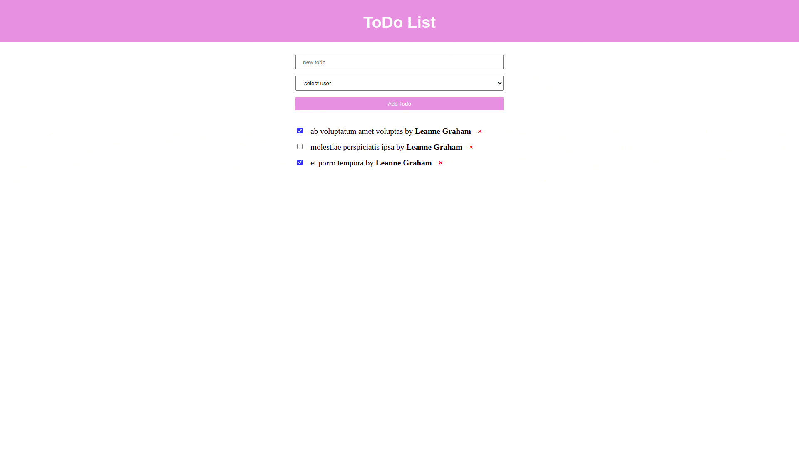

# Мини-приложение To-do List
Приложение реализует добавление записей в список дел. Пользователи в выпадающем списке и начальный список дел, появляющийся после загрузки страницы, реализуются с помощью *JSONPlaceholder*. Каждый пункт списка можно отметить выполненным или удалить.

